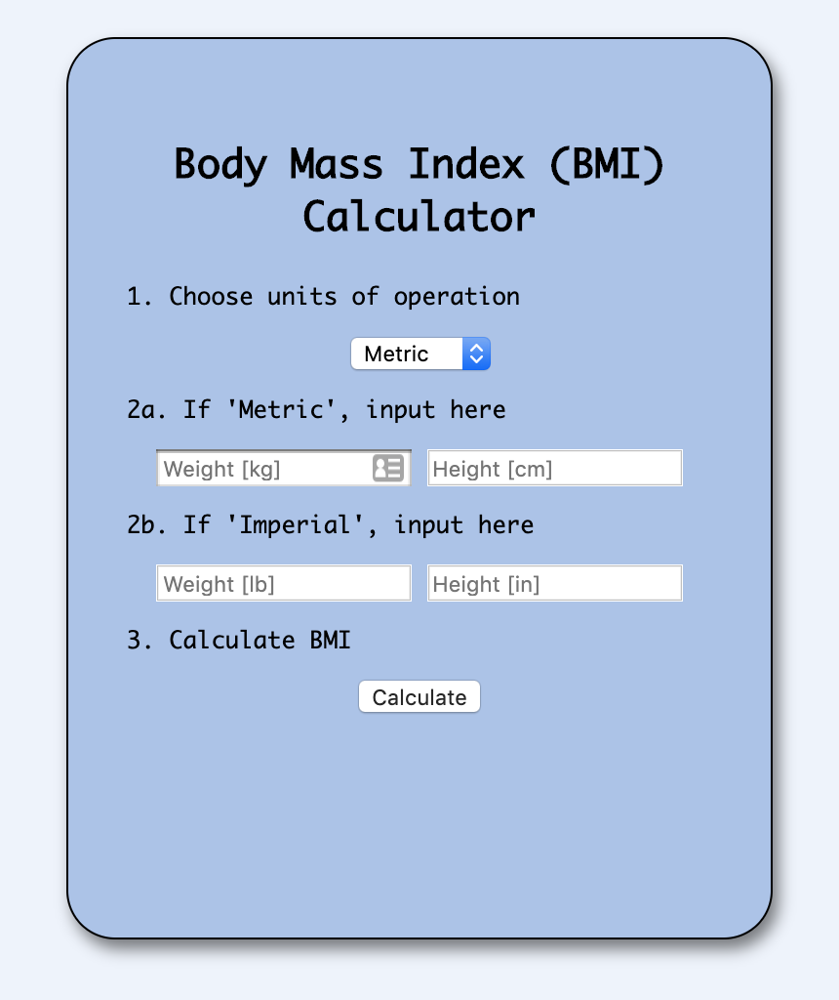
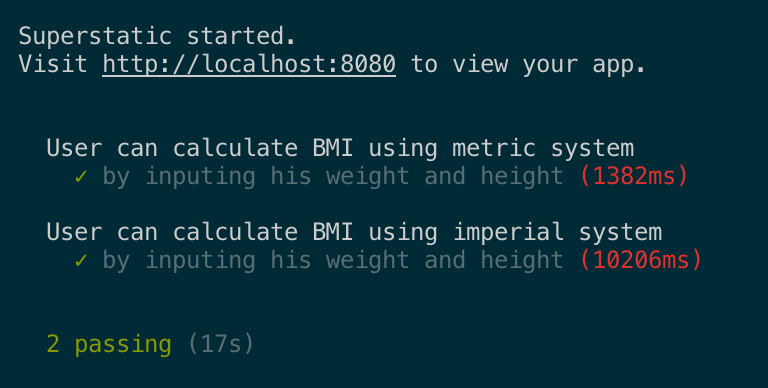
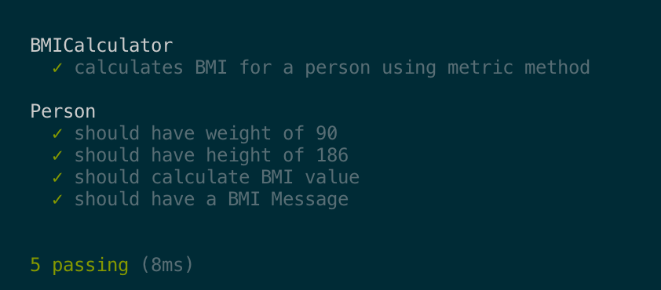

# Front End Application: Body Mass Index (BMI) Caclulator
Developed and documented by,
* Aubain, Max - [Github](https://github.com/CA-ma)

## Summary
**Front end**: HTML; CSS; and JS.<br>
**Back end**: N/A.<br>
**Testing**: End-to-end (e2e) Training Wheels - unit and feature test.

This repository contains a code base for a Body Mass Index (BMI) calculator web app.  A BMI calculator<sup>1</sup> returns an 'index' value based on the height and weight of an individual.  The 'index' is proportional to the ratio of weight to height, so as weight increases and/or height decreases, the 'index' will increase.  [According to the Department of Health & Human Services](https://www.nhlbi.nih.gov/health/educational/lose_wt/BMI/bmi-m.htm), a U.S. Government agency, the 'index' value correlates to the following conditions:

```
Underweight = less than 18.5
Normal weight = 18.5 to 24.9 
Overweight = 25 to 29.9 
Obesity = 30 or greater
```

<sup>1</sup>A BMI Calculator assumes a particular 'average' body type and is not necessarily an accurate measure of any individual person's body fat percentage, nor is it an accurate measure of one's general health. It is simply an 'index' correlated to the occurance of certain diseases such as heart disease. Therefore, it is only a relative guide.  Personal health decisions should be made with the feedback of a licensed medical professional.

The methods that govern the BMI calculator app are developed with Javascript and styled in the view with HTML and vanilla CSS options.  The methods and features of the calculator are tested using a package called [End To End Training Wheels](https://www.npmjs.com/package/e2e_training_wheels), which is a lightweight JS testing framework that can implement both unit and feature tests.

## Deployment and UI
The [BMI Calculator application](https://ca-ma.github.io/bmiCalcDeploy/) is deployed using Github Pages.  It is designed to have a intuitive interface in which the user can input their height and weight, in either metric or imperial units, and the app returns their BMI.



## Building, Development, and Testing
To locally run or test this application, fork this repository to your github account and clone to a local workspace.  The following instructions (for Mac OS terminal) will configure your local workspace with the necessary package manager and packages.  You can also refer to the e2e Training Wheels [installation guidelines](https://www.npmjs.com/package/e2e_training_wheels#installation).

```
// Initialize Node Package Manager (NPM)

$ npm init   

// Install e2e Training Wheels

$ npm i e2e_training_wheels --save-dev          
$ node ./node_modules/e2e_training_wheels/dist/install.js

// Run feature and unit tests sequentially

$ npm test
```

Development is accomplished using Test Driven Development (TDD) and Behavior Driven Development (BDD) principles.  As such, tests are written before coding to set targets for minimum functionality of the app from a user's perspective.

Two classes are defined, the Person class and the BMICalculator class.  The Person class is defined in [`/src/js/person.js`](/src/js/person.js) and contains height and weight attributes.  The BMI calculator functions are contained in [`/src/js/bmiCalculator.js`](/src/js/bmiCalculator.js) defining the BMI calculation in metric and imperial units and the calculation output message.

The tests for the Person class are contained in [`/spec/person.spec.js`](spec/person.spec.js) that test an instance of the class with specific input parameters, and the output of the BMI calculator with the given set of Person instance parameters.  The BMI Calculator class test is contained in [`/spec/bmiCalculator.spec.js`](/spec/bmiCalculator.spec.js), defining  (test dummy) instance of the Person and an instance of the Calculator to calculate the BMI and verify its output.    

The application feature test are contained in [`/features/index.feature.js`](/features/index.feature.js) and test the application functionality when the view is connected to the logic as defined.  `before`, `beforeEach`, and `after` functions in the feature test control the browswer behavior during the test, while the step definitions specify how to interact with the view.  Specifically, which form field inputs are used and the order in which form buttons are selected.  Separate `describe` blocks are defined in the feature test to verify the metric and imperial calculations.

Running the tests using `$ npm test` in accordance with the files defined above will produce the feature tests and unit tests results.

**Feature Test Results**<br>


**Unit Test Results**<br>
 

## Acknowledgements
Thank you to [Craft Academy](https://craftacademy.se/) in Stockholm, Sweden for crafting this challenge.